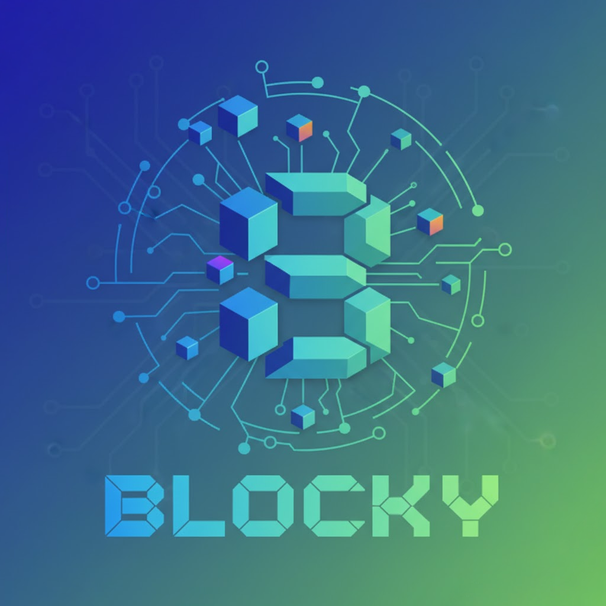

# Blocky

 
    

A decentralized blockchain-based marketplace enabling secure peer-to-peer trading of used items without relying on a central platform.

## Features 🚀
- Create and publish new listings on the blockchain (with title, description, image?, and price);
- Buyers can purchase items by paying the corresponding amount in ETH (or ERC20 tokens);
- Funds are held in escrow — securely locked within the smart contract until the transaction is completed;
- Funds are released only when one of the following conditions is met:
    - the buyer confirms the purchase;
    - a timeout expires, automatically finalizing the sale.
- In case of issues, a dispute can be initiated, allowing further resolution mechanisms.

## Technologies 🛠️
...

## Installation 📦
...

## Usage 🧑‍💻
...

## Contribution 📄
If you'd like to contribute to KeyForge, please follow these steps:
- Fork the repository.
- Create a new branch (git checkout -b feature/YourFeatureName).
- Commit your changes (git commit -m 'Add some feature').
- Push to the branch (git push origin feature/YourFeatureName).
- Open a pull request.

## License 📜
This project is licensed under the MIT License. See the LICENSE file for details.

### Utils 🧊
Blockchain:
- npx hardhat node
Deploy:
- npx hardhat ignition deploy ./ignition/modules/Marketplace.ts --network localhost
Fast interaction:
- npx hardhat run scripts/interact.js --network localhost 
Frontend
- cd frontend
- npm run dev